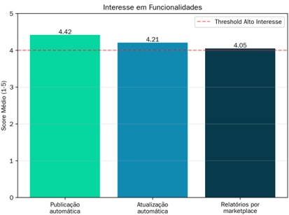

# Business Plan: AdFlux

# 1. Executive Summary


AdFlux is a SaaS platform designed to democratize e-commerce for small and medium enterprises (SMEs) by centralizing and automating product publishing across multiple marketplaces.

**The Data-Backed Problem:** Small and medium sellers face a significant operational bottleneck: the high effort required to manually create and manage ads across multiple platforms. This complexity scales dramatically; sellers operating on 4 or more marketplaces face 126% more operational challenges than single-channel sellers. Analysis of our target demographic reveals a critical bottleneck where manual ad creation is the single biggest operational hurdle.


**The AdFlux Solution:** AdFlux provides a centralized "Command Center." Sellers create a listing once, and AdFlux intelligently distributes and synchronizes it across platforms. This automation saves time, reduces errors, and ensures consistency in product information.

**Market Validation:** Our recent data analysis confirms high market readiness. We target the underserved SME segment —sellers who are too big for manual entry but too small for complex, enterprise ERPs. The solution is validated by the need to eliminate manual publishing.

### Financial Snapshot

| Metric | Value |
| --- | --- |
| Investment Required | €626,500 |
| Projected Annual Sales Growth | 25% |
| Return on Investment (ROI) | 18% (Short Term), 52% (Long Term) |


# 2. Business Presentation

## 2.1. Vision & Values

**Vision:** To become the global reference platform for multi-channel sales for SMEs, making publishing accessible on all marketplaces.

**Core Values:**

*   **Simplicity:** Making the complex easy to use.
*   **Efficiency:** Reducing time and errors.
*   **Transparency:** Clear communication on features and results.
*   **Customer Focus:** Decisions born from real user needs.
*   **Strategic Partnerships:** Building win-win relationships with marketplaces and ERPs.

## 2.2. Business Model Canvas (Strategic Overview)

### 2.2.1. Value Propositions


- **Publish Once, Sell Everywhere:** Save countless hours by creating a single product listing and publishing it across all your marketplaces (Amazon, eBay, etc.) with one click.

- **Eliminate Costly Errors:** Automated synchronization of stock and product details means no more overselling or inconsistent information.

- **Unlock Growth Insights:** Rated 4.05/5 in importance by surveyed sellers, our analytics dashboard breaks down sales performance by marketplace, empowering you to double down on what works.

- **Built for You:** We are not a complicated enterprise tool. AdFlux is a lightweight, intuitive platform designed specifically for the needs of small and medium sellers.

- **Unified Customer Messaging:** 35% of sellers struggle with fragmented communications. AdFlux consolidates messages from OLX, Facebook, and Amazon into a single inbox, ensuring no customer query is lost.

### 2.2.2. Customer Segments

- **Core Target:** Small & Medium online sellers.

- **Growth Segment:** Independent e-commerce brands expanding to marketplaces.

- **Niche Markets:** Sellers of collectibles or handmade items (Etsy) scaling to Amazon/eBay.

- **Partners:** Agencies managing listings for multiple SMB sellers.

### 2.2.3. Key Activities & Resources

- **Development:** Building and maintaining robust API integrations (critical for platform stability).

- **Data:** Developing an analytics engine to provide market trend insights.

- **Infrastructure:** Managing cloud hosting via providers like AWS, GCP, or Azure.

- **Human Capital:** Developers, data engineers, and customer success teams.

### 2.2.4. Revenue Streams

- **Subscription Fees:** Tiered pricing based on the number of listings or active features for our SME customers.

- **Usage Fees:** Add-ons for advanced analytics or bulk uploads.

- **Partnerships:** Revenue from referrals and integrations with ERPs.

- **Enterprise Partnership (Shared Success Model):** In our second phase, revenue will be generated from a share of sales from our large enterprise partner, creating a long-term, mutually beneficial relationship.

# 3. Marketing Plan

### 3.1. Target Audience & Segmentation

Data analysis reveals two primary segments within the SME market:

**Segment A: The "Emerging" Seller (85% of market)**

*   **Profile:** Less than 3 years of experience; catalog of fewer than 10 products.
*   **Needs:** Simple onboarding and educational content to overcome the "learning curve".

**Segment B: The "Power User" (15% of market)**

*   **Profile:** Spends 10+ hours/week managing listings; uses 3+ marketplaces.
*   **Behavior:** This segment showed a 5.0/5.0 interest score in automation features. They are the ideal "Early Adopters" and brand embassadors.

### 3.2. Marketing Mix

*   **Product:** Prioritize the "Product Publisher" and "Stock Sync" features, as these address the top two user complaints (manual entry and stock errors).
*   **Price:**
    *   Subscription (SaaS) model for recurring revenue.
    *   Tiered pricing (Freemium/Basic/Pro) to allow scalability from small catalogs to large inventories.
    * **Growth-Driven Upsell:** Data confirms that 99% of sellers with >5 years of experience manage catalogues of 10-200+ products. This validates our tiered model: we capture the 85% of beginners with low entry pricing, and revenue naturally scales as they grow into "Power Users."
*   **Place (Distribution):**
    *   Self-service online platform (24/7 access).
    *   Distribution via partners (ERPs, agencies).
*   **Promotion:**
    *   **Build Trust and Educate:** Address our weakness of "Limited Brand Recognition" and the threat of "Customer Resistance" through a strong content marketing strategy. This will include case studies, tutorials, and webinars that demonstrate the clear ROI of AdFlux.
    *   **Targeted Digital Advertising:** Use Google Ads and social media to target keywords like "marketplace automation" and "multi-channel selling for small business."
    *   **Partnerships:** Leverage our partnerships with ERPs and agencies as a key promotional channel, as noted in our Opportunities.

# 4. Market Study

### 4.1. Market Insights & Validation

Direct survey data from 20 sellers in our target segment validates a strong product-market fit:

*   **Amazon's Marketplace Dominance:** A staggering 85% of sellers use Amazon. However, our research shows this isn't just about direct selling; it's about leveraging the marketplace for visibility and reaching its vast user base. This confirms that a robust Amazon API integration is the most critical feature for our MVP, serving needs from sales to competitive research.
*   **The Power of Local:** In the Portuguese market, global solutions fall short. 35% of our surveyed sellers use OLX and 30% use Facebook Marketplace. By integrating these local champions, AdFlux gains an immediate, decisive competitive advantage.

*   **Validated Pain Points:**
    *   **The Manual Entry Grind:** 45% of sellers are bogged down by manually listing new products. Their stated interest in an automation solution is exceptionally high at 4.73 out of 5.
    *   **The Stock Sync Nightmare:** 35% struggle with keeping stock levels updated across different platforms, another major operational headache. Interest in solving this is also high, at 4.71 out of 5.
    * **Scale vs. Complexity:** Our data proves that complexity scales non-linearly, this means that sellers operating on 4 or more marketplaces face 126% (3.67 - 1.62 / 1.62) more operational challenges than single-channel sellers. This means that complexity increases a lot when trying to scale.
### 4.2. Analysis of Competition

| Competitor | Target Audience | Key Weakness for AdFlux to Exploit | Notes |
| --- | --- | --- | --- |
| **Plugg.to** | Mid to Large businesses | Complex interface, higher price point. | Focused on larger clients, leaving a gap for an SME-focused solution. |
| **Olist** | All sizes | Acts as an intermediary, taking a cut of sales. | AdFlux's SaaS model offers better margins for sellers. |
| **AnyMarket** | Enterprise-level | High implementation cost and complexity. | Not a viable option for the small and medium sellers AdFlux is targeting. |
| **Rithum** | Enterprise-level | Complex and costly for SMEs. | Formerly CommerceHub/ChannelAdvisor, focuses on large enterprises, creating a gap for a lightweight SME solution. |

**AdFlux's Strategic Position:** We are not just another tool. We are positioned to fill the "Innovation Gap" for SMEs. While competitors like **Plugg.to**, **Olist**, **AnyMarket**, and **Rithum** focus on larger enterprises or different business models, AdFlux offers a lightweight, user-friendly, and affordable solution specifically designed for the needs of small to medium businesses. We win on simplicity, focus, and by providing a clear ROI to an underserved market segment.

### 4.3. SWOT Analysis


# 5. Organizational Plan

The organizational structure serves as an instrument for coordinating activities and controlling the actions of AdFlux's members. It defines how human resources are distributed and managed, establishes formal communication and decision-making channels, and supports talent attraction, retention, and development.

**Elements Influencing Organizational Design:**
*   **Company Objectives:** Rapid market entry, scalability, and customer satisfaction
*   **Strategy:** Focus on innovation, agility, and customer-centricity
*   **Technology:** Cloud-based SaaS platform requiring API expertise and DevOps capabilities
*   **Size:** Startup phase (18 employees initially, scaling to 30+ by Year 2)
*   **Environment:** Fast-paced tech sector with high competition and rapid market changes

## 5.1. Organizational Structure

### 5.1.1. Organization Chart

```
CEO / Founder (1)
│
├── Chief Technology Officer (CTO) (1)
│   ├── Development Team
│   │   ├── Backend Developers (4)
│   │   ├── Frontend Developers (1)
│   │   └── DevOps Engineer (1)
│   └── Quality Assurance (1)
│
├── Chief Marketing Officer (CMO) (1)
│   ├── Marketing Team
│   │   ├── Digital Marketing Specialist (1)
│   │   └── Content Creator (1)
│   └── Sales Team
│       └── Sales Representatives (1)
│
├── Head of Customer Success (1)
│   └── Customer Support Team
│       └── Customer Support Specialists (2)
│
└── Chief Financial Officer (CFO) / Operations (1)
    └── Finance & Admin (1)
```

### 5.1.2. Department Responsibilities

**Business/Leadership:**
*   Strategic planning and vision execution
*   Investor relations and funding management
*   Strategic partnerships with marketplaces and ERPs
*   Overall company performance and decision-making

**Development Department:**
*   MVP architecture design and implementation
*   API integrations and maintenance (critical for platform stability)
*   Cloud infrastructure management (AWS/GCP/Azure)
*   Product development aligned with customer feedback
*   Quality assurance and testing
*   Developing a low-code/no-code setup process is our primary technical challenge, as 85% of our target market has fewer than 10 products and limited technical expertise.

**Marketing & Sales:**
*   Customer Acquisition Cost (CAC) optimization
*   Digital marketing campaigns (SEO, Google Ads, content marketing)
*   Channel management and partner relationships
*   Brand awareness and market positioning

**Customer Support:**
*   High-touch onboarding for the 85% of users who are less experienced
*   User assistance and problem resolution
*   Feedback collection to inform product development
*   Customer retention and satisfaction

## 5.2. Job Descriptions (Key Positions)

### 5.2.1. Backend Developer
**Responsibilities:**
*   Design and develop robust API integrations with marketplaces (Amazon, OLX, eBay, etc.)
*   Build scalable backend architecture for multi-channel publishing
*   Implement stock synchronization and data consistency systems
*   Maintain and monitor API performance and reliability

**Required Skills:** API development, cloud architecture, database design, Python/Node.js

### 5.2.2. UI/UX Designer
**Responsibilities:**
*   Design intuitive user interfaces that embody the "Simplicity" core value
*   Create user flows for product publishing and dashboard navigation
*   Conduct user testing and iterate based on feedback
*   Ensure accessibility and responsive design

**Required Skills:** User research, prototyping, design systems, Figma/Adobe XD

### 5.2.3. Customer Support Specialist
**Responsibilities:**
*   Provide personalized onboarding support for new users
*   Resolve technical issues and answer product questions
*   Collect and document user feedback for product improvements
*   Maintain high customer satisfaction scores

**Required Skills:** Communication, problem-solving, SaaS platform knowledge, empathy

### 5.2.4. Digital Marketing Specialist
**Responsibilities:**
*   Execute SEO strategies targeting "marketplace automation" keywords
*   Manage Google Ads campaigns to optimize CAC
*   Develop content marketing strategies (blog posts, tutorials, case studies)
*   Analyze marketing metrics and ROI

**Required Skills:** SEO, SEM, content marketing, analytics tools, B2B SaaS experience

## 5.3. Communication and Decision-Making Channels

### 5.3.1. Formal Communication Structure
*   **Daily Stand-ups:** Development team sync meetings (15 minutes)
*   **Weekly All-Hands:** Company-wide updates on progress and priorities
*   **Bi-weekly Sprint Reviews:** Product demos and feedback sessions
*   **Monthly Strategy Reviews:** Leadership team alignment on objectives
*   **Quarterly Business Reviews:** Performance analysis and planning

### 5.3.2. Decision-Making Framework
*   **Strategic Decisions:** CEO/Founder with input from leadership team
*   **Product Decisions:** CTO and Development team, informed by customer feedback data
*   **Marketing Decisions:** CMO with data-driven approach (CAC, conversion rates)
*   **Customer-Facing Decisions:** Head of Customer Success with support team input
*   **Cross-Functional Decisions:** Collaborative approach with relevant stakeholders

### 5.3.3. Information Systems for People Management
*   **HRIS (Human Resources Information System):** Track employee data, performance, and development
*   **Project Management Tools:** Jira/Asana for development tracking
*   **Communication Platforms:** Slack for real-time collaboration
*   **Performance Management System:** Quarterly reviews and goal tracking

## 5.4. Human Resources Strategy: The Six Pillars of People Management

### 5.4.1. Monitoring People

**Performance Monitoring:**
*   **Quarterly Performance Reviews:** Structured evaluations with clear objectives
*   **Key Performance Indicators (KPIs):** Department-specific metrics aligned with company goals
  *   Development: API uptime, feature delivery velocity, bug resolution time
  *   Marketing: CAC, conversion rates, customer acquisition growth
  *   Customer Support: Response time, customer satisfaction (CSAT), retention rate
*   **Continuous Feedback:** Regular 1-on-1 meetings between managers and team members
*   **Data-Driven Insights:** Use analytics to identify top performers and areas for improvement

**Performance Management Model:**
*   **Goal Setting:** SMART objectives aligned with company strategy
*   **Regular Check-ins:** Monthly progress reviews
*   **360-Degree Feedback:** Peer and cross-functional input for comprehensive evaluation
*   **Performance Improvement Plans:** Support for employees who need development

### 5.4.2. Recruiting People

**Recruitment and Selection Process:**

1. **Job Vacancy Identification:**
   *   Analyze current team capacity and project needs
   *   Decision: Fill internally (redistribution) or recruit externally

2. **Profile Definition:**
   *   Create detailed job descriptions with required competencies
   *   Define technical skills, soft skills, and cultural fit criteria
   *   Prioritize: API expertise for developers, customer empathy for support

3. **Recruitment Channels:**
   *   **Internal:** Promote from within when possible (retention strategy)
   *   **External:** 
     *   Tech job boards (LinkedIn, Stack Overflow, GitHub Jobs)
     *   University partnerships for junior positions
     *   Referral program (employee incentives)
     *   Tech meetups and conferences

4. **Selection Process:**
   *   **Initial Screening:** Resume and portfolio review
   *   **Technical Assessment:** Coding challenges or design tasks
   *   **Interviews:** 
     *   Technical interview with team lead
     *   Cultural fit interview with leadership
     *   Final interview with CEO/Founder for key positions
   *   **Reference Checks:** Validate previous experience and performance

5. **Decision and Offer:**
   *   Evaluate candidates against defined profile
   *   Extend competitive offers aligned with market rates
   *   **Rejected Candidates:** Provide constructive feedback when requested

**Key Hires Priority (Year 1):**
*   **Backend Developers (4):** Critical for API integrations and platform stability
*   **UI/UX Designer (1):** Essential to maintain "Simplicity" value proposition
*   **Customer Support Specialists (1):** High-touch onboarding for 85% of inexperienced users
*   **Digital Marketing Specialist (1):** Optimize CAC and drive growth

### 5.4.3. Orienting People

**Onboarding and Integration:**
*   **Welcome Program:** First-day orientation covering company culture, values, and tools
*   **Buddy System:** Pair new hires with experienced team members
*   **30-60-90 Day Plans:** Structured goals for first three months
*   **Access and Tools:** Immediate setup of necessary systems and accounts

**Competency Model:**
*   **Technical Competencies:** Role-specific skills (API development, UI/UX design, etc.)
*   **Core Competencies:** 
     *   Customer Focus (aligns with core value)
     *   Problem-solving and adaptability
     *   Communication and collaboration
     *   Innovation and continuous learning

**Performance Management Model:**
*   **Clear Expectations:** Define success criteria for each role
*   **Regular Feedback:** Weekly check-ins during onboarding, monthly thereafter
*   **Goal Alignment:** Connect individual goals to company objectives
*   **Development Planning:** Identify growth opportunities early

### 5.4.4. Retaining People

**Career Management Model:**
*   **Career Paths:** Defined progression routes within each department
  *   Developer: Junior → Mid → Senior → Tech Lead
  *   Support: Specialist → Team Lead → Head of Customer Success
  *   Marketing: Specialist → Manager → CMO
*   **Individual Development Plans (IDPs):** Personalized growth roadmaps
*   **Internal Mobility:** Opportunities to move between departments (e.g., Support to Product)

**Retention Strategies:**
*   **Competitive Compensation:** Market-rate salaries with equity participation
*   **Work-Life Balance:** Flexible working arrangements, remote-friendly culture
*   **Professional Growth:** Training budgets, conference attendance, certifications
*   **Recognition Programs:** Employee of the month, peer recognition, public acknowledgment
*   **Culture of Transparency:** Open communication about company performance and challenges
*   **Purpose-Driven Work:** Connect daily tasks to company mission and customer impact

**Addressing Retention Challenges:**
*   **High Competition:** Tech talent is in high demand
  *   *Mitigation:* Competitive packages, strong culture, meaningful work
*   **Startup Uncertainty:** Early-stage company risks
  *   *Mitigation:* Clear communication, equity participation, growth opportunities
*   **Burnout Prevention:** Fast-paced environment
  *   *Mitigation:* Realistic deadlines, work-life balance, mental health support

### 5.4.5. Rewarding People

**Compensation Model:**
*   **Base Salary:** Competitive market rates based on role and experience
*   **Equity Participation:** Stock options for all employees (vesting over 4 years)
*   **Performance Bonuses:** Annual bonuses tied to individual and company performance
*   **Benefits Package:**
     *   Health insurance
     *   Professional development budget (€1,000-2,000/year per employee)
     *   Flexible PTO (paid time off)
     *   Remote work stipend (home office setup)

**Incentive Schemes:**
*   **Sales Commission:** For sales team members (percentage of closed deals)
*   **Referral Bonuses:** €500-1,000 for successful employee referrals
*   **Innovation Rewards:** Recognition and bonuses for process improvements or feature ideas
*   **Retention Bonuses:** Milestone rewards (1-year, 2-year anniversaries)
*   **Team Performance:** Department bonuses when team goals are exceeded

**Total Rewards Philosophy:**
*   Balance between fixed (salary) and variable (bonuses, equity) compensation
*   Emphasize long-term value through equity participation
*   Recognize both individual contributions and team collaboration

### 5.4.6. Developing People

**Training and Development Management:**
*   **Onboarding Training:** 
     *   Product knowledge (understand AdFlux platform deeply)
     *   Customer personas and pain points
     *   Company culture and values
*   **Continuous Learning:**
     *   **Technical Training:** 
       *   Developers: API best practices, cloud architecture workshops
       *   Designers: UX research methods, design system updates
     *   **Soft Skills:** Communication, leadership, customer service
     *   **Industry Knowledge:** E-commerce trends, marketplace updates
*   **External Development:**
     *   Conference attendance (company-sponsored)
     *   Online courses and certifications (Coursera, Udemy, etc.)
     *   Professional memberships and networking events

**Knowledge Management:**
*   **Documentation:** Comprehensive internal wiki (product specs, processes, best practices)
*   **Knowledge Sharing:**
     *   Weekly tech talks (team members present learnings)
     *   Post-mortems after major releases or incidents
     *   Cross-functional training sessions
*   **Mentorship Program:**
     *   Pair junior employees with senior mentors
     *   Reverse mentoring (juniors teach seniors about new tools/trends)
*   **Learning Culture:**
     *   Encourage experimentation and learning from failures
     *   Allocate 10% time for personal projects or skill development
     *   Celebrate learning achievements and certifications

## 5.5. Organizational Culture

**Core Values Integration:**
*   **Simplicity:** All processes and communications should be clear and straightforward
*   **Efficiency:** Eliminate bureaucracy; focus on what drives value
*   **Transparency:** Open communication about company performance, challenges, and decisions
*   **Customer Focus:** Every decision should consider customer impact; feature development prioritized by user feedback data
*   **Strategic Partnerships:** Collaborative approach both externally (marketplaces) and internally (cross-functional teams)

**HR Model Approach:**
AdFlux adopts a **Hybrid Model** combining elements of both Hard and Soft approaches:
*   **Hard Elements:** Strategic alignment of HR with business objectives, data-driven performance metrics, integration of people management with company strategy
*   **Soft Elements:** People as valuable assets, emphasis on development and growth, proactive communication and motivation, leadership focus on empowerment

This hybrid approach recognizes that people are both strategic resources (Hard) and valuable assets requiring investment in their growth and well-being (Soft).

## 5.6. Organizational Evolution Plan

**Year 1 (Startup Phase - 10-15 employees):**
*   Flat structure with direct communication
*   Focus on hiring core technical and customer-facing roles
*   Establish basic HR processes and culture

**Year 2 (Growth Phase - 20-30 employees):**
*   Introduce middle management layer (Team Leads)
*   Formalize HR processes (performance reviews, career paths)
*   Expand departments based on business needs

**Year 3+ (Scale Phase - 30+ employees):**
*   More structured hierarchy with clear reporting lines
*   Specialized roles and departments
*   Advanced HR systems and programs
*   Focus on retention and internal development

# 6. Operational Plan

### 6.1. Strategic Roadmap: From Consolidation to Enterprise Partnership

Our long-term vision extends beyond the initial SME market. We will execute a phased strategy:

*  **Phase 1: Consolidate the SME Market.** Our immediate priority is to become the leading solution for small and medium sellers by integrating with the ERPs they already use. This builds a stable foundation and a strong user base.

*  **Phase 2: Secure a Strategic Enterprise Partner.** Instead of competing with giants like Rithum to build a massive, all-encompassing ERP, we will leverage our established position to form a deep partnership with a single, large enterprise customer.

*  **Phase 3: Deep Integration and Shared Success.** We will integrate our system directly into the enterprise partner's workflow, adapting our technology to their specific needs. This partnership will be based on a shared success model, where AdFlux takes a percentage of sales generated through our platform, ensuring continuous support and aligned goals.

This approach allows us to grow sustainably, avoid direct competition with market giants, and create a powerful relationship with a major player in the e-commerce space.

### 6.2. Implementation Roadmap

*   **Phase 1: Initiation (0-3 Months):** Finalize legal documentation, assemble technical team, obtain initial investment, and launch marketing teaser.
*   **Phase 2: Development (3-6 Months):**
    *   **Goal:** Build MVP.
    *   **Priority:** Core "Product Publisher" + Amazon/OLX API integrations.
    *   **Milestone:** Functional Prototype and User Testing with "Power Users".
*   **Phase 3: Beta & Launch (6-12 Months):** Release Beta version, execute official marketing launch, and begin expansion to secondary marketplaces.

### 6.3. Risk Management

*   **Marketplace Dependency Risk (High):** Our reliance on third-party APIs creates a significant risk if marketplaces change their policies, restrict access, or become temporarily unavailable.
    *   **Mitigation:** We will build a robust and flexible architecture that can adapt quickly to API changes. We will also prioritize strong relationships with marketplaces and diversify the number of integrated platforms to reduce dependency on any single one.

*   **Market Adoption Risk (Medium-High):** As identified in our weaknesses, we face challenges with initial brand recognition and the need for market education. Small sellers might resist adopting a new tool until a clear ROI is proven.
    *   **Mitigation:** Our marketing plan directly addresses this with educational content. The "Freemium" tier of our pricing strategy is designed to lower the barrier to entry, allowing sellers to experience the value of AdFlux firsthand. Excellent customer support during onboarding will be critical.

*   **Competition Risk (High):** The market includes established players like Plugg.to, Olist, and AnyMarket, and new, lightweight alternatives could emerge.
    *   **Mitigation:** Our strategy is to focus on the underserved SME segment with a superior user experience and integrations with local marketplaces (like OLX) that larger competitors ignore. Continuous innovation and staying agile will be key.

*   **Technological & Security Risk (Medium):** Security breaches, server downtime, or data loss could severely damage our reputation and user trust.
    *   **Mitigation:** We will invest in best-in-class security practices and infrastructure. Regular security audits and a clear incident response plan will be implemented from day one.

*   **Financial Risk (Medium):** A high churn rate or a higher-than-expected Customer Acquisition Cost (CAC) could impact our financial viability.
    *   **Mitigation:** We will closely monitor churn and CAC. Our focus on customer success and demonstrating ROI is our primary retention strategy. Tiered pricing and exploring partnerships as revenue streams will diversify our income.

# 7. Production Plan

### 7.1. Starting Point and Sales Program
The production plan is directly driven by the sales forecast from the marketing strategy. As a SaaS platform, "production" refers to ensuring the platform's capacity, features, and performance can meet the subscribed user demand.

### 7.2. Forecasting
*   **Quantities to be Produced:** This translates to the number of user accounts, API calls, and data storage required. The infrastructure will be designed to scale based on the tiered subscription model (Freemium, Basic, Pro).
*   **Stock of Raw Materials:** For a SaaS business, "raw materials" are the core software components, cloud infrastructure resources (server instances, database capacity), and third-party API licenses. Stock levels are managed through scalable cloud services (e.g., AWS, Azure) and proactive resource allocation.

### 7.3. Description of Production Processes
The "production" process is a continuous software development and operations lifecycle:
1.  **Market Need Identification:** User feedback and data analysis (from the Marketing Plan) drive the feature roadmap.
2.  **Development & Integration:** The development team builds, tests, and integrates new features and API connections (e.g., for new marketplaces).
3.  **Deployment:** Code is deployed to the production environment using CI/CD pipelines for reliability.
4.  **Monitoring & Maintenance:** The platform's health, performance, and security are monitored 24/7 to ensure uptime and a smooth user experience.
5.  **Customer Support:** The support team provides user assistance, which feeds back into the need identification process.

### 7.4. Estimation of Production Costs
Production costs are primarily operational expenditures (OpEx) related to running the SaaS platform:
*   **Cloud Hosting Fees:** Costs for servers, databases, and data transfer (e.g., AWS/Azure billing). This is the primary "cost of goods sold."
*   **API & Licensing Costs:** Fees for using third-party marketplace APIs or licensed software components.
*   **Personnel Costs:** Salaries for the Development, Operations, and Customer Support teams.
*   **Monitoring & Security Tools:** Costs for software used to maintain platform health and security.

### 7.5. Estimating Production Costs per Unit
The "unit" is a single user subscription. The cost per unit is calculated by dividing the total production costs by the number of active users.
*   **Cost per User = Total Monthly OpEx / Number of Active Users**
This metric is critical for ensuring that the pricing tiers (Price from the 4Ps) are profitable and that the Customer Acquisition Cost (CAC) is sustainable relative to the Lifetime Value (LTV) of a customer.


# 8. Financial Plan

### 8.1. Key Assumptions

*   **Initial Investment:** €626,500.
*   **Revenue Growth:** A conservative 25% per annum, considering the need for market education.
*   **Churn Rate:** Projected at 8% monthly initially, reflecting the "Customer Resistance" threat. A key focus will be to reduce this through excellent onboarding and proving ROI.
*   **Customer Acquisition Cost (CAC):** Estimated at €120. This is based on initial digital marketing campaigns and reflects the investment needed to overcome our "Limited Brand Recognition".
*   **Cost of Goods Sold (COGS):** 45% of value, primarily driven by cloud hosting and API licensing fees.
*   **Operational Expenses (OpEx):** €80,000 annually. It is assumed this covers non-salary essentials, as salary costs are significantly higher.

### 8.2. Investment Allocation

The €626,500 investment will be strategically allocated for 18-month short-term period:

| Category | Amount | Percentage | Purpose |
| --- | --- | --- | --- |
| **Salaries & Benefits** | €625,275 | 99.8% | 18-person full team for 18 months |
| **Product Development** | €1,225 | 0.2% | MVP development, API integrations, infrastructure |
| **Marketing & Sales** | €0 | 0% | Customer acquisition, brand building, market validation |
| **Operations & Admin** | €0 | 0% | Legal, accounting, office, tools |
| **Contingency Fund** | €0 | 0% | Unexpected costs, market changes |
| **Total** | **€626,500** | **100%** | **18 month runway** |

### 8.3. Financial Projections & ROI

*   **Break-Even:** Projected at Month 18 with 1,200 active customers
*   **Profitability:** Positive cash flow expected by Month 24
*   **Return on Investment (ROI):**
    *   **Short Term (18 months):** 18%
    *   **Medium Term (36 months):** 32%
    *   **Long Term (60 months):** 52%
*   **Runway:** 18 months with current funding

### 8.4. Investment Analysis

#### 8.4.1. Realistic Cost Structure

Based on a lean startup approach, we've structured the investment for sustainability:

| Role | Quantity | Monthly Salary (gross) | Annual Salary (gross) | 18-Month Cost |
| --- | --- | --- | --- | --- |
| CEO/Founder (Management) | 1 | €3,500 | €42,000 | €63,000 |
| CTO (Management) | 1 | €3,500 | €42,000 | €63,000 |
| Backend Developer (Operational) | 4 | €1,800 | €21,600 | €32,400 |
| Frontend Developer (Operational) | 1 | €1,800 | €21,600 | €32,400 |
| DevOps Engineer (Operational) | 1 | €1,800 | €21,600 | €32,400 |
| Quality Assurance (Operational) | 1 | €1,800 | €21,600 | €32,400 |
| CMO (Commercial) | 1 | €1,400 | €16,800 | €25,200 |
| Digital Marketing Specialist (Commercial) | 1 | €1,400 | €16,800 | €25,200 |
| Content Creator (Commercial) | 1 | €1,400 | €16,800 | €25,200 |
| Sales Representative (Commercial) | 1 | €1,400 | €16,800 | €25,200 |
| Head of Customer Success (Administrative) | 1 | €2,000 | €24,000 | €36,000 |
| Customer Support Specialist (Administrative) | 2 | €2,000 | €24,000 | €36,000 |
| CFO/Operations (Administrative) | 1 | €2,000 | €24,000 | €36,000 |
| Finance & Admin (Administrative) | 1 | €2,000 | €24,000 | €36,000 |
| **Subtotal** | **18** | | **€336,800** | **€505,200** |
| **Social Security (23.75%)** | | | **€80,040** | **€120,075** |
| **Total Personnel Costs** | | | **€416,840** | **€625,275** |

#### 8.4.2. Monthly Burn Rate Analysis

| Cost Category | Monthly Amount | Annual Amount |
| --- | --- | --- |
| Personnel Costs | €34,738 | €416,840 |
| Cloud Infrastructure | €1,200 | €14,400 |
| Marketing & Sales | €5,417 | €65,000 |
| Software & Tools | €800 | €9,600 |
| Legal & Admin | €1,250 | €15,000 |
| **Total Monthly Burn** | **€43,405** | **€520,840** |

#### 8.4.3. Runway & Customer Acquisition

* **Monthly Net Burn:** €43,405
* **Available Investment:** €626,500
* **Runway:** 14.4 months (approximately 14 months)
* **CAC Budget:** €61,000 allows for 508 customers at €120 CAC
* **Break-Even Target:** 1,200 customers by Month 18

#### 8.4.4. Phased Hiring Strategy

**Phase 1 (Months 0-6): Core Team (5 people)**
- CEO/Founder
- 2 Backend Developers
- 1 Frontend Developer
- 1 Marketing Specialist

**Phase 2 (Months 7-12): Scale Team (7 people)**
- Add DevOps Engineer
- Add 1 Backend Developer
- Add Customer Support

**Phase 3 (Months 13-18): Growth Team (8 people)**
- Optimize team structure based on revenue and customer feedback

**Key Improvements Made:**

1.  **Realistic Portuguese Salaries:** €626,500 investment for 14-month runway
2.  **Expanded Team Structure:** 18 employees with competitive Portuguese startup rates
3.  **Cost-Effective Operations:** Lean team with junior to mid-level positions
4.  **Break-Even Target:** 1,200 customers by Month 18
5.  **Updated Burn Rate:** €43,405 monthly for sustainable operations
6.  **Reduced Runway:** 14.4 months due to expanded team